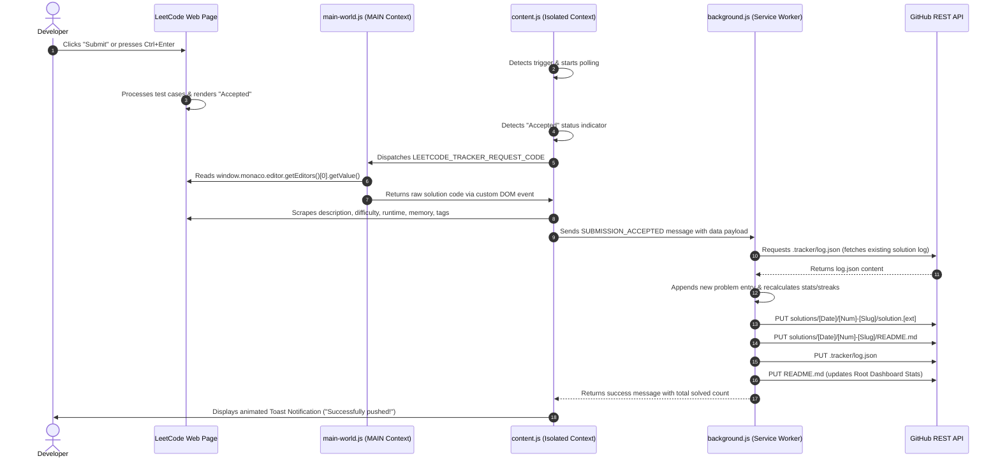

# ⚡ LeetCode → GitHub Tracker

LeetCode → GitHub Tracker is a professional, Manifest V3-based Chrome Extension that automatically monitors, scrapes, and synchronizes your accepted LeetCode submissions to a dedicated GitHub repository. 

Beyond simply copying code, it parses problem metadata to build a structured log database, creates individual, clean problem descriptions with Shields.io badges, and maintains an interactive, real-time statistics dashboard in your repository's root `README.md` complete with solve streaks, visual progress bars, and recent activity tables.

---

## 🚀 Key Features

* **Instant Automatic Synchronization:** Detects accepted solutions and pushes them to GitHub immediately, completely eliminating manual copy-pasting.
* **Premium Config & Diagnostic UI:** Includes a GitHub Dark-themed popup panel with connection validation diagnostics, storage configurations, and direct stats summaries.
* **Intelligent Code Extraction:** Bypasses Chrome’s extension context isolation to retrieve the raw code directly from LeetCode’s dynamic Monaco Editor.
* **Automated Repository Dashboards:**
  * Calculates and displays your active daily **solve streak**.
  * Shows visual progress bars for Easy, Medium, and Hard problem distributions.
  * Lists a dynamically updated table of your 20 most recently solved problems.
* **Clean Directory Structure:** Automatically groups files by date and problem ID in your target repository.

---

## 📂 Repository Directory Layout

Once synchronized, the extension structures your target GitHub repository as follows:

```
.
├── .tracker/
│   └── log.json                 # JSON database tracking history, runtime, & metadata
├── solutions/
│   └── [YYYY-MM-DD]/            # Daily grouping folder
│       └── [paddedId]-[slug]/   # Specific problem folder (e.g., 0001-two-sum)
│           ├── README.md        # Individual problem sheet (description, badges, stats)
│           └── solution.[ext]   # Raw solution code with customized metadata headers
└── README.md                    # Root repository dashboard & statistics board
```

---

## 📐 Extension Architecture & File Structure

The Chrome Extension is designed around a modular architecture to adhere to Chrome's Manifest V3 security model:

```
leetcode-github-tracker/
├── manifest.json       # Metadata, permissions, host rules, and injection setups
├── background.js       # Background Service Worker handling GitHub REST API integrations
├── content.js          # DOM Observer and Scraper (runs in isolated context)
├── main-world.js       # Script running in MAIN context to read LeetCode variables
├── popup.html          # Configuration UI (GitHub Dark Theme layout)
├── popup.js            # Controller handling popup logic, test calls, and local storage
└── icons/              # Extension brand asset icons (16px, 48px, 128px)
```

---

## 🔄 System Workflow & Communication Pipeline

The following sequence diagram outlines how the extension transitions from a user submission on LeetCode to a committed file on GitHub, highlighting the asynchronous bridges between content script worlds:



---

## 📊 Data Model & Entity Relationship (ER)

The extension maintains configuration settings locally and compiles a structured log database inside the Git repository. The data schema and relationships are described below:

```mermaid
erDiagram
    CHROME_STORAGE ||--|| SETTINGS : "stores config"
    SETTINGS {
        string githubOwner "GitHub Username"
        string githubRepo "Repository Name"
        string githubToken "Personal Access Token"
    }

    SUBMISSION ||--|| PROBLEM_FILE : "generates code file"
    SUBMISSION ||--|| PROBLEM_README : "generates documentation"
    SUBMISSION }|..|* LOG_DATABASE : "appends metadata record to"
    LOG_DATABASE ||--|| DASHBOARD_README : "regenerates stats on"

    SUBMISSION {
        string number "Problem ID number"
        string title "Problem title"
        string slug "URL slug identifier"
        string difficulty "Easy | Medium | Hard"
        string[] tags "Topics list"
        string description "Full description text"
        string code "Raw source code"
        string language "Language used"
        string runtime "Execution time & percentile"
        string memory "Memory usage & percentile"
        string url "LeetCode problem URL"
        string timestamp "Submission ISO time"
    }

    LOG_DATABASE {
        list entries "Array of historical records"
    }

    DASHBOARD_README {
        string streak "Calculated daily consecutive solve streak"
        int total "Total solved count"
        int easy "Easy solved count"
        int medium "Medium solved count"
        int hard "Hard solved count"
        string lastUpdated "Date of last sync"
        list recentSubmissions "Last 20 solved problems table"
    }
```

---

## 🛠️ Deep Dive: Technical Challenges & Solutions

### 1. Bypassing Chrome Extension Isolation (Monaco Editor Scraping)
* **Challenge:** Chrome Extensions run content scripts in isolated environments. While they have access to the page's DOM, they cannot access standard JavaScript objects on the page, such as LeetCode's `window.monaco` editor instance where the user's code lives. Basic DOM scraping for code is extremely fragile and often truncates comments or formats incorrectly.
* **Solution:** Developed a dual-world communication system. The content script injects `main-world.js` into the page's standard JS context (`world: "MAIN"`). The two worlds coordinate asynchronously via custom DOM events. When a submission succeeds, the content script triggers a request event, the main-world script reads the value directly from the Monaco editor instance (`window.monaco.editor.getEditors()[0].getValue()`), and posts it back safely. If this fails, the extension falls back to scraping CodeMirror lines or pre tags.

### 2. Reliable SPA Status Tracking
* **Challenge:** LeetCode is a dynamic Single Page Application (SPA). Pages update dynamically without full refreshes, rendering standard page load events useless. Additionally, "Accepted" status messages render asynchronously after tests execute.
* **Solution:** Implemented a multi-vector polling engine triggered by three signals: (a) physical clicks on the submit button, (b) standard hotkey triggers (`Ctrl + Enter`), and (c) navigation changes indicating a route transition to `/submissions/`. Once triggered, the engine starts an incremental, low-overhead poll (up to 5 minutes) searching for the exact "Accepted" indicator before scraping the code, runtime, and memory stats.

### 3. Serverless Streak & Stats Calculation
* **Challenge:** I wanted the extension to run entirely client-side without any server databases. Calculating daily streaks and maintaining stats graphs required building database-like records inside git commits.
* **Solution:** Background workers use sequential GitHub API updates. First, they fetch `.tracker/log.json`, parse the historical array, and append the new entry. A JavaScript utility calculates consecutive calendar-date diffs to calculate the current daily streak. The worker then uses this metadata to construct customized markdown progress bars and badges, committing all file updates in sequence.

---

## ⚙️ Installation & Setup

1. **Clone or Download the Repository:**
   ```bash
   git clone https://github.com/Bylerma/CommitLeet.git
   ```
2. **Load the Extension in Chrome:**
   * Open Google Chrome and navigate to `chrome://extensions/`.
   * Enable **Developer mode** using the toggle switch in the top-right corner.
   * Click the **Load unpacked** button in the top-left corner.
   * Select the folder containing the extension files (`/ext`).
3. **Configure the Extension:**
   * Click on the extension icon in the Chrome toolbar to open the settings popup.
   * Fill in your details:
     * **GitHub Owner (Username):** Your GitHub profile name.
     * **Repository Name:** The repository where you want to sync your solutions (e.g., `CommitLeet`).
     * **GitHub Token:** A Personal Access Token (Classic or Fine-grained) with `repo` (contents read/write) permissions.
   * Click **Save Configuration**, then click **Test Connection** to verify settings.
4. **Start Coding:** Solve any problem on LeetCode, hit submit, and watch your solution sync to GitHub instantly!

---

## 🛡️ License

This project is licensed under the MIT License - see the LICENSE file for details.